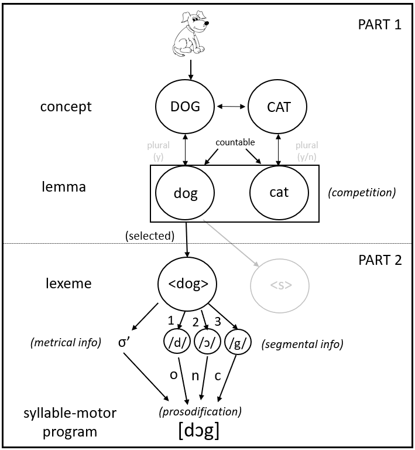

# Meaning to Form {#CognitiveArchitectureI}

__Written by__ _Rinus Verdonschot_  
__Edited by__ _Vitória Piai_ for consistency and brevity  
<!--__Reviewed by__ _soon defined_  -->

Have you ever wondered how people go from wanting to say something to actually speaking it out loud? This turns out to be quite complicated with numerous steps involved. However, we can all do this very quickly and efficiently as it typically takes only little over half a second before speaking starts [@indefrey_spatial_2004] and we hardly make errors [@butterworth_lexical_1989]. 

Here, I will explain the basic steps of this ability and take the model of Levelt, Roelofs and Meyer [-@levelt_theory_1999] as the main guide. However,  you should be aware that there are other models which take different stances on some of the claims the Levelt et al. model makes [@bloem_semantic_2003; @caramazza_how_1997; @dell_spreading-activation_1986; @Mahon_lexical_2007]. <!--As this section is meant to be brief, please notice that: (1) I will not be talking about reading aloud written words (as this involves reading), (2) I realize we usually produce words in sentences in context but I will only talk about intentionally producing single meaningful words here as, for now, this is already difficult enough to understand and lastly (3) I will only talk about producing monomorphemic nouns (e.g., dog). So, for example, I will not discuss how things like inflections (e.g., walk vs. walked), derivations (child-childish) and compounds (e.g., doghouse) are produced (see Baayen, 2007, for more information if you are interested in these issues). -->The model is laid out in the figure below to make it easier for you to follow the separate steps.

```{r leveltmdl, echo=FALSE, out.width="80%", fig.cap="The Levelt, Roelofs & Meyer (1999) model of language production. (σ= syllable, o= onset, n=nucleus, and c=coda)"}

```

So, let’s start. Basically, there are two parts involved in speaking. The first part entails activating the meaning-related aspects of what one would like to say and the second part involves creating the sound form of the word. The Levelt et al. model assumes that some kind of network is involved here, with “nodes” at each level representing different kinds of information and “activation” spreading between these nodes.

## Starting with the meaning 
For example, if you see a big dog running towards you, you may want to shout “DOG” to your friends in order to make them aware of it. <!--The information on how a dog looks and how it is pronounced is of course somewhere stored in your brain. There are two possibilities for how the concept “DOG” could be activated. One possibility is by its set of features alone (i.e., a dog typically has four legs, a tail, a certain way the head looks, etc.) without a dedicated node, and the other possibility is that there is a dedicated “DOG” node somewhere in your mental lexicon (which can be activated by seeing particular features of the animal running towards you, though these features themselves are not part of it). The first way is called compositional storage (Hillis & Caramazza, 1995) and the second way is called decompositional storage (Roelofs, 1992). There is considerable debate on this (see Roelofs, 1997), but the Levelt et al. model assumes the concept “dog” is decompositional. One reason for assuming this is that we hardly make errors involving the features, for example, we almost never mistakenly say “tail” instead of “DOG” which would be expected if features alone would drive the activation of “DOG” (Levelt, 1989). 

-->So, once the concept “DOG” becomes activated, it will spread some of its activation to its neighbours. In other words, if you want to say “DOG”, actually semantically related concepts like “CAT” or “HORSE” also become available, especially if they are closer together in the network. 

## The lexical level {#lemma}
Any activated concept will spread some of its activation to its so-called “lemma” node. This is a memory representation of the word's meaning and its syntactic properties. With syntactic properties we mean that languages may store particular syntactic information of words here. For example, whether it is countable (e.g., “three dogs”) or uncountable (e.g., “food”, but not "three foods"), or if a language has a gender system (like German, French, Dutch, etc.), the gender of the word would be stored at this level. So, in German, for example, the lemma node for dog (“Hund”, [der Hund]) would have “masculine” and “countable” assigned to it (amongst other things). 

Assume for now that only the DOG and CAT concepts are activated and they both send activation to their respective lemma nodes. According to the Levelt et al. [-@levelt_theory_1999] model, only for one of them the sound form can be constructed, that is: one lemma must be selected for production. But how could a lemma win then? One way it could win is by assuming there are inhibitory links between activated lemmas. In other words, the “dog” lemma would be activated and inhibitory links would exist to other activated lemmas (e.g., cat) which it can then use to actively extinguish them. However, the Levelt et al. model does not adopt any inhibitory links anywhere. Instead, it assumes that the activation of nontarget lemmas affects the time it takes to select the target lemma. In other words, lemmas like *cat* and *dog* do compete for selection over time (but not via inhibitory links). To decide who wins, the model uses a simple mathematical rule (a so-called “hazard rate”) to calculate the probability an activated lemma “survives” or “dies” over time depending on the activation of all co-activated lemmas. Once a lemma is selected (i.e., “survives”), activation will cross from the conceptual/syntactic information (Part 1 in Figure \@ref(fig:leveltmdl)) to the phonological/articulation level (Part 2 in Figure \@ref(fig:leveltmdl)).

That this division (i.e., between Part 1 and 2) is not a simple trivial thing can be seen for example in the “tip-of-the-tongue” phenomenon (see Section \@ref(intro)) in which one would know some semantic information (e.g., “Hmm. That actor who plays in Avatar”) or whether something is countable or not, but one could not (completely) reach the pronunciation or only part of it (e.g., “S…Sa.. something”). 

## The phonological level {#phonolevel}
Once a lemma has been selected for production, it will activate a so-called “lexeme”. Now, three pieces of information become available for the word you would like to produce. First, the morphology of a word. In the case of < dog > this is simple as it is a monomorphemic word (i.e., you cannot break down < dog > into smaller units that still carry meaning). But a word such as < reappear > consists of two morphemes: < re- > and < appear >. Another case would be a plural, so if your intention was to say “DOGS”, then the lemma dog would have become activated and a syntactic “flag” for plurality would have been set there, then at the lexeme level both < dog > and < s > (plural suffix of dog) would become activated. 

Next, the so-called metrical information becomes available, which (for Dutch, English, and German for example) states how many syllables the word consists of and where the stress is located. In the case of < dog > this is easy as it is just one stressed syllable (σ’; σ = syllable, ‘ = stress). But, for example, the metrical information for < forest > would specify that it has two syllables (σ’σ) with stress on the first syllable (i.e., FOrest). 

Concurrently, the individual segments of the word would become available, that is: /d/, /ɔ/, /g/ (the ɔ means an open-mid back rounded vowel). Then a process would start called “prosodification” in which the individual segments would be incrementally put into the metrical frame. Meaning that /d/, /ɔ/, /g/ would be incrementally put into σ’ resulting in [dɔg]. Huh? You might say. Why so complicated, why not just store [dɔg]? Well, for “dog” it is easy, but many languages have things such as re-syllabification. Re-syllabification means that depending on the word that precedes or follows a word, the “original” syllable may change. For example, if you take the word combination “hike is” in “This hike is fun”, then you will notice that “hike is” is syllabified as [haɪ] [kiz] so the /k/ did not stay with /hike/ but moved to the next word /is/. It is impossible to store all possible word combinations, so it is very likely that a process such as prosodification exists, though perhaps not in the same form for all languages [@Verdonschot_proximate_2021].   

So, what we finally end up with is a representation that will be used to guide the creation of a gestural score (that is, the motor plan to move the articulators to produce speech). How this works will be dealt with in Section \@ref(CognitiveArchitectureII).

:::insum
__Take-home messages__  

* There are two parts involved in speaking: the activation of meaning-related aspects of the intended words and the creation of the sound form of the words   
* From an activated concept, activation will spread to a "lemma" node (a memory representation of the word’s meaning and its syntactic properties)   
* From a selected lemma, the phonological information is activated, containing information over morphemes, syllables and stress patterns, and individual sounds (phonemes)   
::: 

:::reading
__Suggestions for further reading__  
The interested reader is referred to additional literature on models of word production, including the theoretical debates in the field [@dell_stages_1992; @abdel-rahman_semantic_2019; @caramazza_how_1997; @Mahon_lexical_2007; @roelofs_context_2013].
::: 

:::exercise
Think about the errors you collected in section \@ref(intro). Can you work out at what stage (from those discussed above) they emerged? Note that it could be that they emerge during another stage that we haven't discussed yet. 
:::
