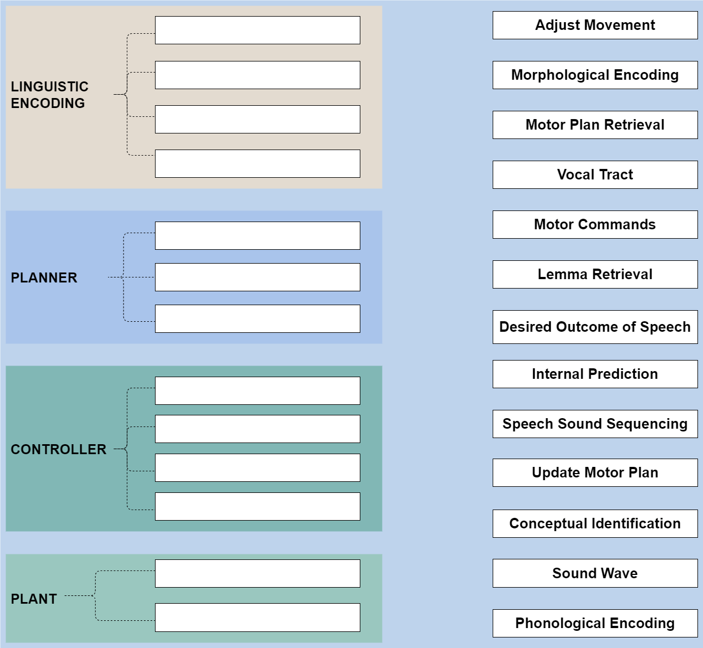

# Form to Articulation {#CognitiveArchitectureII}

__Written by__ _Julia Chauvet_  
__Edited and reviewed by__ _Caroline Niziolek_ 


Imagine typing a familiar password on your keyboard: your fingers move quickly and accurately, pressing each key in the right sequence without you needing to look closely or consciously guide them. This is much like how we speak: Our brain forms a plan based on the message we want to express and, drawing on previous experience, it directs our speech muscles to articulate the words—just like the fingers typing on the keys.

Following the syllabification of the phonological plan, as we saw in Section \@ref(phonolevel), several processes must occur before the speaker can articulate their message. First, during motor planning, the phonological word is temporarily buffered in a way that preserves the serial order of the phonological items (\@ref(sequencing)). Next, the largest available motor program for producing the forthcoming phonological units is selected (\@ref(motorplans)). In psycholinguistics, this stage is known as phonetic encoding [see for review @laganaro_phonetic_2019]. Finally, articulatory processes comprise the execution stage of speech production. During this stage, specific motor commands direct the movements of the articulators, and errors can be detected and corrected via updates to these motor commands. This is where the control layer of speech production models becomes directly involved (\@ref(motorcontrol)).

Each of these speech production processes have been described by conceptual frameworks and computational models. A computational model articulates a theory by converting it into a set of rules and equations, thereby making it possible to test the theory by simulating it on a computer. We will look at how computational models like DIVA  [Directions Into Velocity of Articulators, @guenther_speech_1995; @guenther_neural_2016] and its associated sequencing model GODIVA [Gradient Order DIVA, @bohland_neural_2010], TD [Task Dynamics, @saltzman_skilled_1987], and FACTS [Feedback-Aware Control of Tasks in Speech, @parrell_facts_2019] deal with different speech production processes. We will also look at SFC [State Feedback Control, @houde_speech_2011], which is a conceptual framework in motor control theory for which speech-specific neural pathways have been proposed. To aid in understanding, key terms and concepts used throughout this discussion are summarized in the accompanying definitions box below.


```{r, echo=FALSE, results='asis'}
cat('
<div style="background-color: #c2ddd9; padding: 15px; border-radius: 5px;">
<table style="width: 100%;">
<tr>
<td>
<h4 style="margin-top: 0;">Key concepts in speech motor planning and speech motor control</h4>
<p><strong>Articulation:</strong> The physical movements of the muscles of the vocal tract required to produce speech sounds.</p>
<p><strong>Buffering:</strong> In the context of speech motor control, <em>buffering</em> refers to temporarily maintaining phonological units in an active state before they are executed as motor commands. The phonological material is held in a working memory buffer, allowing it to be sequenced and accessed in the correct order for articulation.</p>
<p><strong>Feedforward and feedback control:</strong> Feedforward control involves generating motor commands to achieve the desired movements and mechanisms to predict the sensory outcome of the movements. Feedback control adjusts movements in real time to correct deviations from the intended speech output.</p>
<p><strong>Gestural score:</strong> In the Task Dynamics model, gestural scores refer to how gestures (the movements that produce the speech sounds) are organized and timed relative to each other to form speech. Gestural scores are time-varying sequences of overlapping articulatory (vocal tract constriction) targets.</p>
<p><strong>Internal model:</strong> In the efference copy framework, an internal model refers to a neural representation that predicts the sensory consequences of a planned movement before it is carried out. When the brain generates a motor command, an efference copy of this command is sent to the internal model, which simulates the expected outcomes (such as proprioceptive or auditory feedback) of the movement.</p>
<p><strong>Mental syllabary:</strong> A repository where motor plans for frequently used syllables are stored (Crompton, 1982; Levelt, 1989).</p>
<p><strong>Motor commands:</strong> Specific instructions generated by the brain (cortical and subcortical structures) that direct the movements of the muscles. In speech motor control, these are sometimes referred to as <em>articulatory trajectories</em>.</p>
<p><strong>Motor control:</strong> The process by which humans and animals use their brain and nervous system to activate and coordinate the muscles and limbs involved in the performance of a motor skill.</p>
<p><strong>Motor plan, or motor program:</strong> A set of packaged motor commands specifying exact articulatory configurations needed to produce a learned sound. Such plans, or programs, exist for all the phoneme inventory of our native language, as well as frequently produced sequences of speech sounds such as syllables or overlearned words.</p>
<p><strong>Proprioception:</strong> Proprioception is specifically about sensing body position and movement, and allows you to know, without looking, where your limbs and articulators (like your tongue or lips) are in space and how they are moving. It is one part of the larger somatosensory system, which also includes other sensations like touch and temperature.</p>
<p><strong>Speech motor planning:</strong> Preparing the articulatory system for movement based on the linguistic structure of the intended utterance. This involves preserving the order of the phonological units and retrieving motor programs, thereby setting the desired outcome of speech.</p>
<p><strong>Speech sound sequencing:</strong> Part of speech motor planning, this refers to the process of temporarily buffering phonological units in working memory to ensure their serial order is preserved for coherent speech production. The buffer allows for sequential activation, where each phonological unit is selected by competitive choice, and the most active unit is processed first. This ensures that the speech sounds are produced in the correct serial order.</p>
<p><strong>Vocal tract:</strong> The many anatomical structures that are involved in phonation, resonation, and articulation. For example, the vocal cords, the larynx, the tongue, the glottis, the lips, and the nasal cavity.</p>
</td>
</tr>
</table>
</div>
')
```

## Speech sound sequencing {#sequencing}

How does our brain manage the complexity of producing longer speech utterances such as multisyllabic words or phrases? The GODIVA model was developed to describe the sequencing of smaller units (such as syllables) into a complex utterance. GODIVA involves computations that (1) temporarily store (i.e., buffer) phonological items within phrases in a way that preserves their serial order and (2) sequentially activate the appropriate motor programs for these items at the proper instants in time. First, the phonological material is buffered in a planning layer. The serial order of the units in the sequence is encoded in this planning layer such that earlier items in the utterance have higher activity than later-occurring units. The most active unit in the planning layer buffer is then selected by competitive choice [@bohland_neural_2010]. Following activation in the choice layer, that item is then suppressed in the planning layer, allowing for sequential activation of the remaining units in the correct order as the process iterates throughout the remainder of the sequence. Each selected chunk of material will be translated into the associated motor plans, which we turn to next.

## Motor plans {#motorplans}

When we retrieve motor plans, we essentially translate the intended linguistic utterance into instructions to be sent to articulatory muscles. In other words, we transition from phonological to sensorimotor frames of reference. In this section, we will look into the size of motor plans and the types of units they typically involve.

How speakers store and retrieve articulatory routines for associated phonological content is a topic explored in both psycholinguistics and speech motor control literature. These routines are referred to in various ways: motor plans [@levelt_theory_1999], motor programs (DIVA) or gestural scores (TD). For frequently used syllables, speakers may retrieve stored motor plans from what is known as the mental syllabary. Conversely, for less frequent or novel syllables, plans corresponding to phonemic segments are assembled on-the-fly [@levelt_speaking_1989; @crompton_syllables_1982]. The DIVA model extends this concept beyond syllables and segments to include overlearned words and sub-syllabic units such as consonant clusters [@segawa_chunking_2019].

TD conceives of motor plans as gestural scores: much as musical scores are time-varying sequences of possibly overlapping notes, gestural scores are time-varying sequences of possibly overlapping articulatory movements, which are specified as targets of vocal tract constriction. In other words, just like a musical score indicates the timing and intensity of each note in a performance, a gestural score specifies the timing and coordination of articulatory movements needed to produce speech. Although TD does not feature a storage concept like the mental syllabary, it also specifies that frequently executed sequences benefit from well-coordinated and efficiently functioning gestural scores due to repetitive practice.

In summary, speakers adapt to both routine and novel speech production demands by employing motor plans of varying sizes. For frequently used sequences, such as common syllables, plans are learned and stored, allowing the brain to reduce working memory load by retrieving these chunks during motor planning. Conversely, for sequences that are infrequent, new, or even phonotactically illegal, motor plans are assembled segment-by-segment, enabling speakers to produce any combination of speech sounds. This storage and retrieval system for frequent sequences is efficient, while the capacity to assemble plans on-the-fly ensures flexibility in speech production.


## Motor control of speech {#motorcontrol}

When we speak, how do we know if we are articulating the right sound? And, importantly, how does our brain learn from errors to improve future speech? It is generally agreed that motor control for any movement involves (i) generating motor commands (also referred to as articulator trajectories) based on a motor plan, (ii) making an internal prediction of sensory consequences (the proprioceptive sensations), as well as (iii) using feedback control to adjust movements and accurately achieve the desired goal. As the motor commands are executed by the plant (in speech, this is the articulatory system, essentially, your vocal tract), the sensory consequences are monitored and compared to the internal prediction. A mismatch between the prediction and the sensory consequence generates error signals which are used to adjust the ongoing movement in real time. Additionally, the system learns from these mistakes and the error signals are used to update and refine future plans. 
DIVA, TD, SFC and FACTS  adhere to this general framework but differ in their specific implementations of how they carry out and monitor articulator trajectories during speech production.


The DIVA model was developed to account for the neural mechanisms underlying the learning and production of a single speech motor program. It consists of three main parts: a feedforward controller, an auditory feedback controller, and a somatosensory feedback controller. DIVA’s feedforward controller features a Speech Sound Map (SSM) and an Initiation Map. The SSM stores the motor programs of learned speech sounds and other units, as we just discussed in Section \@ref(motorplans), along with their auditory and somatosensory target characteristics. The Initiation Map is responsible for initiating the correct motor program at the proper moment in time—a ‘go’ signal. In DIVA, the desired outcome of articulation is primarily acoustic. This outcome is characterized by the target auditory signal and somatosensory configuration associated with the movement. For example, for a specific vowel, the target would include specific formant frequencies that characterize its acoustic signature. 
During speech production, both the actual auditory feedback (the sound that is heard) and somatosensory feedback (the sensation of the movement) are continuously monitored and compared against their respective targets. If there is a mismatch between the target and actual feedback, an error signal is generated. This error signal is then used by the feedback controller to adjust motor commands to minimize the discrepancy, thereby bringing the produced sound closer to the intended sound. Over time, through repetition and adjustment, the production of speech sounds becomes more refined to consistently achieve the desired auditory and somatosensory outcomes.

In DIVA, the emphasis is thus on comparing target somatosensory and auditory characteristics with actual feedback to fine-tune speech production. Conversely, in TD, real-time correction during a speech act relies primarily on proprioceptive feedback. The current positions and movements of the articulators (like the lips, tongue, etc.) are thought to be immediately accessible to the control system via proprioception. This means that the model does not require external feedback, like auditory input, for real-time adjustments. However, while TD efficiently manages motor control through proprioception, it may overlook adjustments based on auditory feedback, which can be important when unexpected auditory perturbations occur [see for example of such adjustments, @hantzsch_single_2022]. 

The SFC framework describes how the motor system estimates the expected sensory feedback of the planned movement using an internal model, via an efference copy. An efference copy is an internal copy of the motor command that will be sent to the muscles, which is used by the brain to predict the sensory outcomes of a planned movement before receiving real-time feedback [@sperry_neural_1950; @vonholst_reafference_1950]. This allows for a form of preemptive error detection: before actual sensory feedback is received, the brain can already estimate the outcome, evaluate whether the planned motor commands align with the speech goal, and adjust the movement accordingly. According to SFC, actual sensory feedback can still be used to adjust the ongoing movement in case of a discrepancy and update the internal model to improve its accuracy over time. This means that while most adjustments are based on internal predictions, the long-term accuracy of these predictions still benefits from actual sensory feedback. While SFC effectively leverages the principles of efference copy and state estimation, it remains a conceptual framework. Its mechanisms are made computationally explicit in the FACTS model, which we will discuss next. 

The FACTS model combines the task-based control of TD (where the task is to achieve the vocal tract constriction) with the estimation principle of SFC (via an efference copy). As such, FACTS is a hierarchical control system which operates at two levels:  the top level is governed by TD, which specifies tasks like forming a constriction at the lips.  At a lower level, FACTS models the motor control of the articulators by incorporating state estimation from SFC, using both proprioceptive and auditory feedback to predict their state. Rather than relying solely on proprioception, as TD originally did, FACTS dynamically adjusts motor commands based on both predicted and actual sensory feedback. This integration allows for better handling of perturbations, such as mechanical disruptions or unexpected changes in feedback, making speech production more flexible and robust, especially in noisy or unpredictable conditions.

You now have a good overview of how different models and frameworks approach the motor control of speech, each with its unique strengths. For example, DIVA is anatomically grounded, with specific brain areas linked to its components, and it incorporates both somatosensory and auditory feedback to refine speech production. TD models how the speech system dynamically organizes and executes sequences of vocal tract constrictions, relying primarily on proprioceptive feedback. SFC introduces predictive control, allowing for preemptive error detection and correction. Finally, FACTS combines the task-based control of TD with the state estimation principles of SFC, to effectively control the vocal tract's articulators, particularly in situations where sensory feedback is delayed or disrupted.

In summary, producing an intended utterance is not just a process of carrying out set actions but involves a dynamic interplay between prediction, execution, and feedback. Thanks to these mechanisms, we can monitor our vocal output and correct potential errors in the articulation of speech. Self-monitoring and the assessment of language production accuracy will be covered in the next section (Section \@ref(CognitiveArchitectureIII)).


:::insum
__Take-home messages__  
The creation of the sound form of words involves two main aspects:

* Motor planning, or phonetic encoding, during which we retrieve motor plans and set the goals for articulation.
* Motor control, during which motor commands are sent to direct the articulators, and feedback (somatosensory and auditory) is used to adjust the ongoing movement.
::: 


:::exercise
Think about the errors you collected in Section \@ref(intro). Can you work out at what stage from those discussed above they emerged? Note that it could be that they emerge during stages discussed in Section \@ref(CognitiveArchitectureI). 
:::


:::exercise
_Connect the terms to their corresponding processing layers._  

Below is a figure representing the different layers of speech production. The processing layers include **Linguistic Encoding**, **Planner**, **Controller**, and **Plant**. Your task is to match each term (e.g., *Conceptual Identification*, *Motor Commands*) to the correct processing stage in the diagram.
```{r FormToArticulation, echo=FALSE, out.width="100%"}

```
:::


