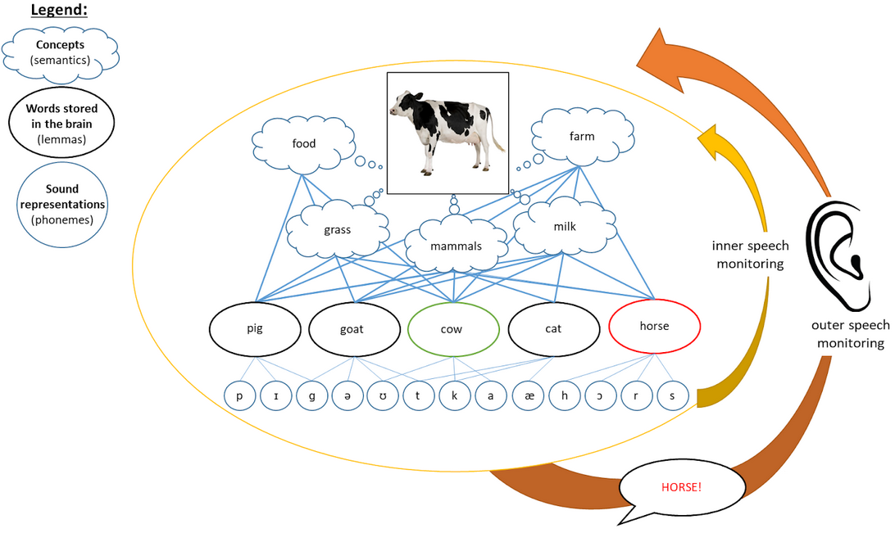

# Monitoring and Control {#CognitiveArchitectureIII}

__Written by__ _Stéphanie Riès_  
__Edited by__ _Vitória Piai_ for consistency and brevity  
<!--__Reviewed by__ _to be defined_     -->

Typical healthy adult speakers are generally very good at speaking and only produce about one error every thousand words selected from 50,000 to 100,000 words in the mental lexicon [@levelt_monitoring_1983]. This ability to produce relatively errorless speech is thought to be enabled in part by the presence of speech monitoring mechanisms. Several theories have been proposed to explain how we monitor our speech [@levelt_theory_1999; @roelofs_spoken_2005; @nozari_is_2011; @gauvin_towards_2020]. While these differ in how speech monitoring is implemented, all of them agree on the fact that speech can be monitored both before and after we can hear ourselves speak. Psycholinguists know that we can monitor our speech before we can hear ourselves speak because we sometimes correct our errors faster than we would if we only relied upon hearing ourselves to monitor our speech production. For example, self-corrections like “v- horizontal” where the speaker started saying “vertical” but corrected themselves after the first phoneme to say the target word “horizontal” could not have been corrected so quickly if we did not have a speech monitoring mechanism catching errors often before we even start producing them. Speech monitoring occurring before we can hear ourselves speak is referred to as _inner speech monitoring_ and how it is implemented varies depending on the theories that have been proposed (see Figure \@ref(fig:monitoring) for a representation of the inner and outer loops of speech monitoring relative to the language production system). 

Some theories propose that inner speech monitoring is supported by the language comprehension system similarly as outer speech monitoring, that is, speech monitoring occurring after we can hear ourselves speak [@levelt_theory_1999; @roelofs_spoken_2005]. Other theories propose that inner speech monitoring is supported within the language production system itself and that a domain-general action monitoring system is involved too [@nozari_is_2011; @gauvin_towards_2020]. One of the reasons some theories propose that inner speech monitoring is not supported by the language comprehension system is that people with a language disorder (see Section \@ref(disorders)) can have speech impairments affecting their language production and their speech monitoring abilities but not their language comprehension [@nozari_is_2011]. Researchers have also found dissociations between how speakers detect errors in their own
speech vs. in others' speech [@nooteboom_parallels_2013]. This also indicates that how we monitor our own speech does not entirely depend on our speech comprehension system.

```{r monitoring, echo=FALSE, out.width="100%", fig.cap="Inner (yellow) and outer (orange) loops of speech monitoring. The outer loop monitors our speech as we hear ourselves speak whereas the inner loop monitors our speech before it is actually produced. Figure adapted with permission from Andrade and Ries [-@andrade_repairing_2022]."}

```


:::insum
__Take-home messages__  

* Healthy adults produce very few errors when speaking, thanks to speech monitoring  
* Speech can be monitored both before and after we can hear ourselves speak, through inner and outer monitoring loops  
* There is a debate in the literature whether inner speech monitoring is supported by the language comprehension system, as in outer speech monitoring, or within the language production system itself  
::: 

:::reading
__Suggestions for further reading__  
The interested reader is referred to additional literature on monitoring and self repairs [@nooteboom_self-monitoring_2017; @boland_repairing_2005], and additional theoretical work [@hartsuiker_error_2001]
::: 


:::exercise
Think about the errors you collected in section \@ref(intro). Is there evidence in those errors that people were monitoring their speech?  
:::

