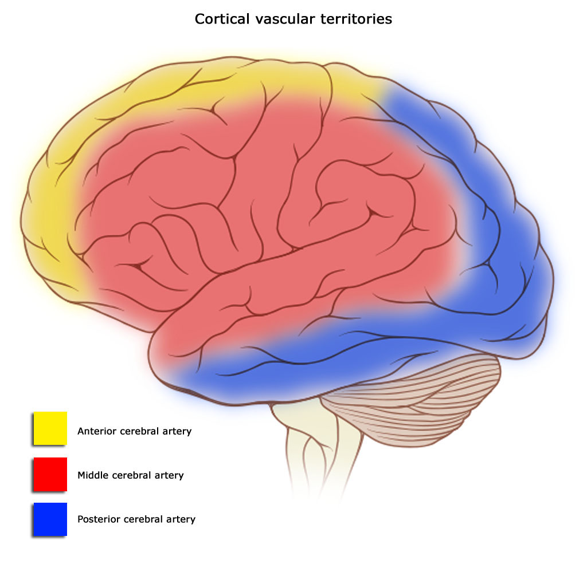

# Speaking and its disorders in adults {#disorders}

__Written by__ _Brielle Stark_ and _Willemijn Doedens_  
__Edited by__ _Vitória Piai_ for consistency and brevity  


So far, we have seen how complicated the process of going from an idea to speaking out loud is. Most of us never stop to think about the complexity of this process because speaking typically happens quickly and effortlessly. For some people, however, going from an idea to speaking is an incredibly effortful, painstaking, time-consuming task, riddled with errors along the way. For some people, speaking is an almost impossible task. In this section, we will discuss how acquired language disorders such as _aphasia_ inform our understanding of the process of going from intention to speaking. We will build on Sections \@ref(CognitiveArchitectureI), \@ref(CognitiveArchitectureII), \@ref(CognitiveArchitectureIII) and take the model of Levelt, Roelofs and Meyer [-@levelt_theory_1999] as our main guide. You should be aware that there are other models that take a different perspective. 

Let’s first start with a definition and common causes of aphasia.

## Aphasia and related disorders
At its core, aphasia is described as a language disorder that affects the building blocks of language including phonology, morphology, semantics and syntax. Aphasia occurs as a consequence of some form of damage to the brain. In this section, we will solely discuss _acquired aphasia_. Acquired refers to the fact that the brain damage occurs after the stage of language development, i.e. in adults. For acquired aphasia, the most common cause is a stroke to the dominant hemisphere (in most individuals, this is the left hemisphere), affecting the middle cerebral artery territory of the brain. This artery is the largest cerebral artery, and feeds the frontal, parietal, and temporal regions of the brain – regions we know work together to help us understand and produce language (see Figure \@ref(fig:vascular) for how blood is fed to different brain areas via the three cerebral arteries). It is thought that 1/3 of individuals experience aphasia acutely after a stroke, and that aphasia persists chronically (usually beyond six months) in a further 33% of people.

```{r vascular, echo=FALSE, out.width="65%", fig.cap="Blood supply to different areas of the brain by three different arteries. Image by Dr. Frank Gaillard, through Wikimedia Commons."}

```

Other possible forms of brain damage that can cause aphasia are traumatic brain injury, viruses or bacterial infections, tumors or tumor resections, and a variety of other brain injuries and diseases. Aphasia can also occur in adults as a consequence of neurodegenerative disease, such as dementia. This type of aphasia is referred to as Primary Progressive Aphasia (PPA). While the different types of aphasias share characteristics and symptoms of language impairment, the overall symptomatology, occurrence of co-morbidities such as other cognitive impairments, the trajectory and prognosis of the aphasias will differ depending on the underlying cause.

Let’s now move on to find out what aphasia can look like. We’ll describe the more ‘classic’ acquired aphasia, as a result of stroke.

## Aphasia types
Broadly speaking, different varieties of aphasia can be characterized into three main categories:   

* predominantly affecting expressive language (i.e., spoken or written language production), which include classifications like Broca’s aphasia and anomic aphasia;
* predominantly affecting receptive language (i.e., understanding spoken or written language), which include classifications like conduction aphasia and Wernicke’s aphasia; 
* affecting both expressive and receptive language, which includes global aphasia. 


We say ‘primarily’ affect because there often are difficulties in both expressive and receptive language, but typically, individuals will show more difficulties in one of those areas. Within each of these categories of aphasia, there is a variety of severities. That is, in the case of two individuals with Broca’s aphasia, one may present with a moderate Broca’s aphasia and another with a severe Broca’s aphasia. These labels can be useful in giving shared terminology to medical providers, clinicians, researchers, and patients. However, it is best practice to consider each individual with aphasia’s strengths and weaknesses in relation to language, rather than to assume they share all characteristics of a single ‘type’ of aphasia.


<!--
There are two main acquired (i.e., following damage to or disease of the brain) language disorders in adults. *Aphasia* affects the building blocks of language including semantics, syntax and phonology. *Cognitive-communication disorders* affect broad cognitive systems like attention and memory, and higher-level language functions such as pragmatics.  

### Primary progressive aphasia
In recent years, primary progressive aphasia (PPA) has become a recognized type of aphasia, which occurs as a result of a neurologically progressive disorder. Currently, there are three recognized variants of PPA: logopenic, nonfluent/agrammatic, and semantic [@gorno-tempini_classification_2011]. We typically think of neurologically progressive diseases as affecting memory, or perhaps personality, but in the case of people with PPA, the first and most primarily affected function is language. Logopenic PPA is characterized by issues in finding words whilst speaking. They may make a variety of paraphasias, especially phonological and verbal errors (see \@ref(errors) below for explanation and examples). Nonfluent/Agrammatic PPA is characterized by slowed motor planning and execution (e.g., difficulty organizing the mouth muscles to speak), and impaired use of grammar (e.g., using simple sentences). Individuals with nonfluent/agrammatic PPA may make agrammatic or paragrammatic errors as well as other types of paraphasias. Finally, semantic PPA is characterized by impaired understanding, as well as losing the meaning of things. They most often make verbal errors, including semantically related and unrelated errors. 

### Acquired cognitive-communicative disorders
Acquired cognitive-communicative disorders are most typical after traumatic brain injuries because these types of injuries tend to be diffuse – that is, affecting a wide variety of brain areas. Whereas a stroke is focal – affecting contiguous brain areas – traumatic brain injuries can cause brain areas to shear apart, become disconnected, or affect non-contiguous brain areas. They associate with disorders of cognition, predominantly, but many individuals affected by traumatic brain injury also present with difficulties in what we call ‘higher’ language functions. These are language functions that are largely social, also termed pragmatics or social language. Presently, there are no recognized ‘types’ of cognitive-communicative disorders, unlike in acquired aphasia.
-->

## Symptomatology {#errors}
Across aphasia, a variety of language errors (“paraphasias”) occur. These are often classified as by the nature of their occurrence, i.e., as phonological, verbal/semantic, syntactic, or as a neologism. Note that these are different from speech errors, which largely involve a problem with the motor programming (see Section \@ref(CognitiveArchitectureII)). Disorders of motor programming and articulation are referred to as _apraxia of speech_ and _dysarthria_, respectively.  

We’re going back to the example of a dog that’s running towards you (Section \@ref(CognitiveArchitectureI)). You may want to shout “DOG” to your friends to make them aware of approaching danger (or cuteness). When someone has aphasia, a number of different problems may occur in the process of retrieving and producing the target word “DOG”, leading to a different outcome. Depeding on the outcome, we can often (__but not always__) approximate where the impairment occured. We’ll discuss these problems below. 

### Lexico-semantic errors
When presented with an image of a dog, some people with aphasia will say  “CAT” instead of “DOG”. This error is labelled as a “semantic” paraphasia: a real (existing) word is produced that is semantically related to the target word (in this case, “DOG”). For the same dog, some people with aphasia produce a real word that is unrelated or vaguely related to the target word. An example of such a verbal paraphasia is when someone might say “VIOLIN” instead of “DOG”. Verbal errors occur across aphasia types. When semantic/verbal paraphasias predominate, it is likely that there is an impairment in the selection or activation of the correct target item. Where exactly the impairment lies, can vary.

A common symptom for people with aphasia, especially anomic aphasia, is difficulty producing the correct word. Some people may produce an incorrect word, others will present with symptoms similar to the “tip-of-the-tongue” phenomenon, as described in Section \@ref(lemma). These difficulties occur at the transition stage from conceptual or lemma information to phonology (see Section \@ref(CognitiveArchitectureI)). As you may imagine, the occurrence of this symptom in every sentence you want to produce can be highly frustrating and disruptive of communication.

### Phonological errors
Now imagine that the response to the dog is “MOG”. In this case, we’re dealing with a word that has a phonological resemblance to the intended target (“OG” as in “DOG”), and the word does not exist in the English language (“MOG”). This is referred to as a phonological paraphasia, sometimes called a phonemic paraphasia. Phonological paraphasias can be a real word or a non-word.

Often times, researchers and clinicians classify phonological errors as sharing approximately 50% of core sounds with the intended target. Phonological errors can involve a variety of sound changes to the target word, as in the examples below:  

* Anticipatory errors occur when a syllable from later in the word replaces a syllable from earlier in the word; e.g., “papple” for apple or “lelephone” for telephone;  
* Perseverative errors occur when a syllable from earlier in the word replaces a syllable from later in the word; e.g., “gingerjed” for gingerbread;  
* Paradigmatic errors based on similarity in how the sounds are formed can also occur; e.g., “marmer” for barber;  
* Addition errors, in which a segment is added that bears no relation to the intended word; e.g., “elenophant” for elephant. Sometimes, addition errors are mistaken for anticipatory errors because of the words surrounding the intended word;   
* Substitution errors involve a clear phonological substitution; e.g., “ragon” for wagon;  
* Epenthetic errors are the insertion of a segment into the target; e.g., “plants” for pants;  
* Metathetical errors are the full exchange of segments, e.g., “deks” for desk;  

Phonological errors occur across aphasia types. In the case of conduction aphasia, a specific type of phonological access error occurs which results in a symptom called _conduit d’approche_. In this symptom, the person accesses a variety of phonetically similar words or partial words before landing on their intended target. For example: “pa- pal- palace- palate- pallor!”.   

### Neologisms 
When someone says “FLUP” instead of “DOG”, it can be difficult to determine what exactly has gone wrong in the process of speaking. This kind of error is referred to as a neologism.

Neologisms are made-up, non-words. It is unclear what origin these neologisms have, as they share fewer than 50% of their sounds with their target (i.e., they cannot be a phonological error) and they’re a non-word, meaning they can’t be classified in the verbal paraphasia category. Sometimes, the target of the neologism is known, but more often than not, the intended target is not known. For that reason, it remains unclear if the neologism is a result of an access issue to the phonological or lexical-semantic system, or both. Neologisms occur frequently in the speech of someone with jargon aphasia. An abundance of neologisms can make it very difficult to understand a person’s language production.

### Syntactic errors
Syntactic or grammatical errors can also occur. There are generally two accepted types of grammatical impairments that arise in aphasia, which are agrammatism (a lack of grammar, or overly simplified/impoverished grammar), and paragrammatism (a misuse of grammar). 

Agrammatic errors involve omission of functor words or small connector words (e.g., prepositions like “for”, “to”, determiners like “the”, etc.), and are common across most types of aphasia but more hallmark in expressive types of aphasia (e.g., Broca’s). An example of agrammatic utterances might be: “Bird there” (meaning, ‘there is a bird over there’) or even just listing of words with the complete omission of grammar, like “bird tree car.” Butterworth and Howard [-@butterworth_paragrammatisms_1987] provide examples of paragrammatic speech, which can include agreement errors, word misplacement, or what Kleist [-@kleist_aphasie_1914] dubs ‘sentence monsters’:  

* “And I want everything to be so talk.” (p. 13)  
* “But it’s silly, aren’t they?” (p. 20)  

Paragrammatic errors are thought to be more common in receptive types of aphasia (e.g., Wernicke’s), but can be present in individuals with any type of aphasia. 

### Pragmatic errors
An example of a pragmatic error would be providing excessive details in conversation or a tendency to monopolize a conversation, having not picked up on social cues. 


:::insum
__Take-home messages__  

*   Aphasia is an acquired language disorder that affects the building blocks of language including phonology, morphology, semantics and syntax  
*   The most common cause of an acquired aphasia is a stroke to the language-dominant hemisphere but other types of brain damage can also cause aphasia  
*   Different types of aphasia exist, affecting both expressive and receptive language to different degrees  
*   A variety of language errors or paraphasias occur, which can be understood in relation to different language production processes or levels  
::: 

:::reading
__Suggestions for further reading__  
The interested reader is referred to additional literature on the epidemiology of vascular aphasia [@croquelois_stroke_2011; @pedersen_aphasia_2004], including its recovery [@el_hachioui_recovery_2012], and on theory-motivated analyses of language errors [@schwartz_theoretical_2013]. For PPA, the interested reader is referred to empirical studies examining language production [@budd_nature_2010; @wilson_connected_2010]. 
::: 


:::exercise
Think about the errors you collected in section \@ref(intro). In what ways would you expect speech errors emerging from a language disorder to be similar or different from those you collected?
:::


