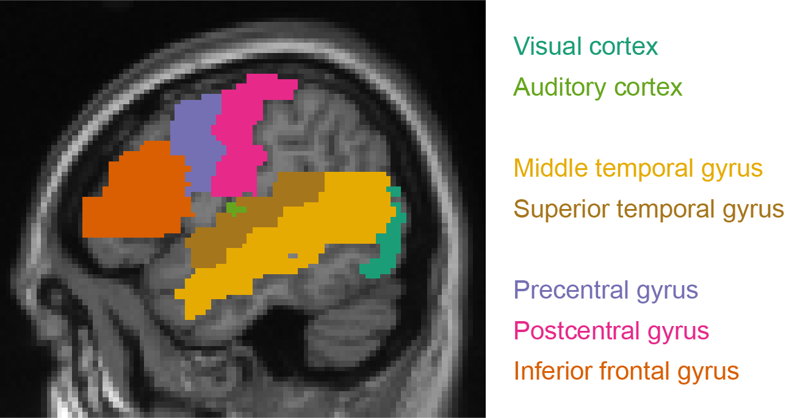

# The speaking brain: Introduction {#introbrain}


The next sections will introduce the _Neuroscience of Language Production_ to the reader, organised by method. The beginning of each section gives a brief explanation about the methodology itself, which should suffice for the reader to comprehend the content of the section.

:::exercise
Think of reasons why research on language production in relation to the brain is less common than comprehension research.
:::

## A brief note on anatomy
Figure \@ref(fig:lateral) shows the anatomical locations of regions that will be important for the "Speaking Brain" sections. 

```{r lateral, echo=FALSE, out.width="80%", fig.cap="Anatomical regions relevant for language production."}

```


Following Indefrey and Levelt [-@indefrey_spatial_2004], the temporal lobe will be divided into anterior, mid, and posterior portions whenever possible.  

## Useful resources  
The following resources can be useful for learning more about anatomy:    
[From the teaching website of the Anatomy & Neurosciences department, AmsterdamUMC](http://www.anatomie-amsterdam.nl/sub_sites/anatomie-zenuwwerking/123_neuro/start.htm)  
[From the Cold Spring Harbor Laboratory](http://www.g2conline.org/3dbrain/)  
