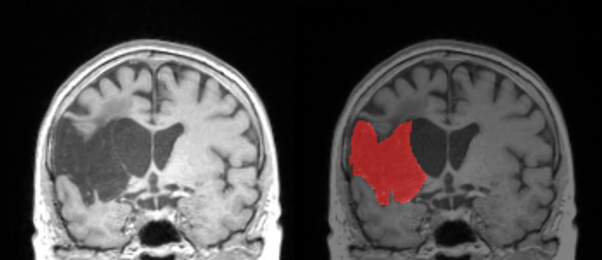
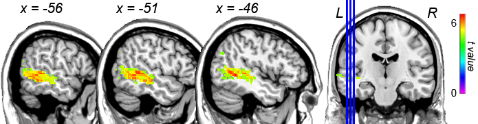
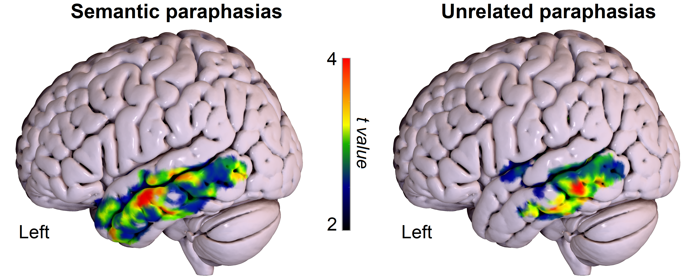

# Lesion-symptom mapping {#LSM}

__Written by__ _Vitória Piai_  
__Reviewed by__ _Brielle Stark_

As we saw in Section \@ref(disorders), neurological conditions can lead to language production deficits or aphasia. To identify the most critical brain areas associated with language production, lesion-symptom mapping (LSM) techniques can be employed [@de_haan_hitchhikers_2018]. Note that these techniques can be applied to virtually any type of behavioural variable.  

One commonly used technique is so-called _voxel-based lesion-symptom mapping_ (VLSM) [@bates_voxel-based_2003]. Using individuals' behavioural scores (e.g., naming accuracy) and a delineation of their affected brain area (e.g., Figure \@ref(fig:lesionmask)),<!---(the "lesion mask", e.g., binary: each voxel is drawn as either lesioned or not, see __FIGURE__ for an example)--> a statistical test is run at the group level at every voxel, comparing scores between individuals with and without damage in that voxel. The resulting map depicts the voxels that are critical for the measured behavioural performance, allowing one to infer a casual relationship between a certain area and a behavioural deficit. Although other types of LSM techniques may work somewhat differently under the hood (e.g., based on volume), they all allow similar inferences, as you will see below.

```{r lesionmask, echo=FALSE, out.width="80%", fig.cap="Illustration of a structural image with a stroke lesion (left) and the corresponding lesion mask in red (right). The lesion mask is expressed as a 3D volume of values. In this example, the voxels in red have the value of 1, that is, lesioned, whereas the non-coloured voxels have the value of 0, that is, not lesioned."}

```

## Evidence from stroke

A study examining picture naming in people with stroke in the chronic phase found that the mid and posterior portions of the left middle temporal gyrus (MTG) were critical for naming performance [@baldo_grey_2013]. Figure \@ref(fig:bntbaldo) depicts these results, with the colours indicating the strength of this association. 

```{r bntbaldo, echo=FALSE, out.width="80%", fig.cap="VLSM results for picture naming accuracy after controlling for visual and motor speech impairments. The colours indicate the strength of the associations. Only the left hemisphere is shown. L = Left; R = Right. VLSM results for making this figure are a courtesy of Juliana Baldo."}

```
Using a measure of word error (i.e., paraphasias) derived from connected speech (i.e., whole sentences) in a picture description task, semantic paraphasias (real words that are semantically related to their intended targets, see Section \@ref(disorders)) were related predominantly to the mid portion of the left superior (STG) and MTG. By contrast, unrelated paraphasias (real words that were semantically unrelated to their intended targets) were associated predominantly with posterior left MTG and inferior temporal gyrus [@stark_neural_2019]. These results are shown in Figure \@ref(fig:stark). Finally, neologistic errors (non-words with no phonological relationship to their target) were associated with pre- and postcentral gyri and supramarginal gyrus. Also using semi-spontaneous speech, impairments in articulation and prosody were found in relation to damage in a frontal region comprising the left insula, the cortical structure that covers it (i.e., "operculum"), and a deeper structure called putamen [@henseler_lesion_2014]. The role of the insula in articulation has also been suggested by a study that used a repetition task of words requiring complex articulatory gestures [@baldo_role_2011].   

```{r stark, echo=FALSE, out.width="80%", fig.cap="VLSM results for semantic (left) and unrelated (right) paraphasias. The colours indicate the strength of the associations. Only the left hemisphere is shown. This figure is a courtesy of Brielle Stark."}

```

## Evidence from brain tumour
In a sample of people with brain tumours prior to surgery, semantic paraphasias and omissions in picture naming were associated with tumours in the left posterior portion of the MTG [@faulkner_mapping_2020], while deficits in naming nonliving objects were particularly associated with tumours in the mid portion of the left MTG [@campanella_naming_2010; see also @fekonja_lesion_2021; @pisoni_object_2018]. Impairment in phonological encoding <!--(i.e., accuracy on word and nonword repetition tasks and effects of word length in picture naming) --> were associated with tumours predominantly in the left posterior supramarginal gyrus and angular gyrus. Finally, articulatory-motor planning deficits were associated with the left frontal cortex, including the inferior frontal gyrus and the insula [@faulkner_mapping_2020].

Post-operatively, overall naming deficits two to three days after surgery were more likely when the mid portion of the left MTG was removed, and at one month post-surgery, an association still existed between left anterior MTG and naming deficits [@wilson_transient_2015]. 


## Evidence from dementia
In primary progressive aphasia (which can occur as a result of several neurodegenerative disorders, including fronto-temporal dementia and Alzheimer's disease), atrophy in the mid portion of the left temporal lobe was associated with the production of nouns of increasing lexical frequency (i.e., easier to produce) in connected speech, whereas phonological paraphasias were associated with atrophy in the mid portion of left STG. Finally, reduced speech rate was associated with atrophy of the left precentral gyrus and left inferior frontal gyrus [@wilson_connected_2010]. <!--Using a different method to image areas of hypometabolism in people with Alzheimer's disease, semantic paraphasias in picture naming were associated with hypometabolism in the mid portion of the left MTG and posterior portion of the inferior temporal gyrus. By contrast, phonemic errors were associated with hypometabolism the left supramarginal gyrus and mid portion of left STG [@isella_metabolic_2020]. ### Brie comment: is hypometabolism technically considered a type of LSM? I think of PET as being more functional and less causal/damage based, but happy to be corrected. -->


:::insum
__Take-home messages__  

* There is a large body of converging evidence across different neurological conditions for word production processes and certain brain areas  
* Performance measures tapping into the conceptual and lexical stages _tend_ to be associated with anterior-to-mid portions of the left temporal lobe, whereas phonological errors tend to be related to posterior temporal lobe, projecting dorsally to supramarginal gyrus and pre- and post-central gyri. There are however exceptions to this strict division    
* Performance measures tapping into motor speech, such as articulation, are associated mostly with left frontal areas, both laterally and in structures lying underneath the lateral cortex and deeper  
:::


:::reading 
__Suggestions for further reading__  
The interested reader is referred to additional literature on LSM, for example for measures derived from connected speech [@borovsky_lesion_2007], for sentence production [@lukic_common_2021], for aphasia clinical measures [@fridriksson_anatomy_2018] and for a comparison between two LSM methods [@geva_comparison_2012]
:::


