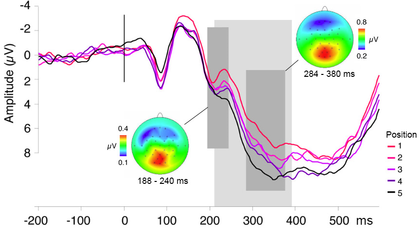
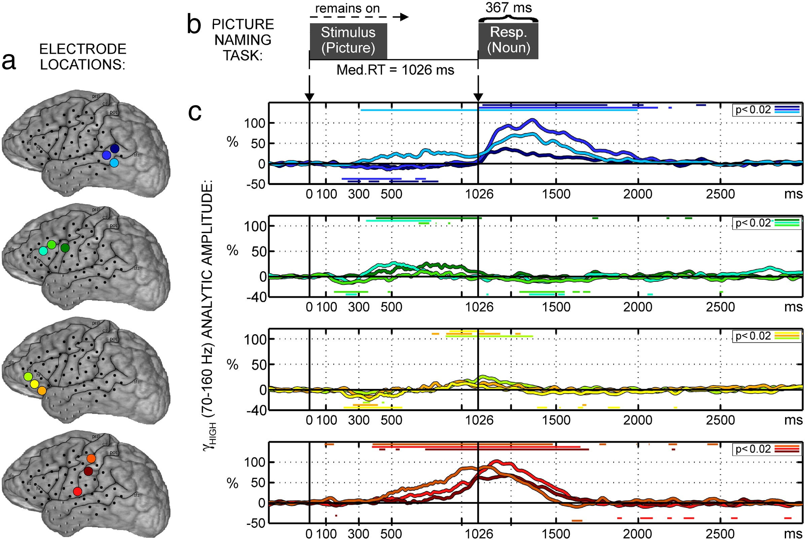
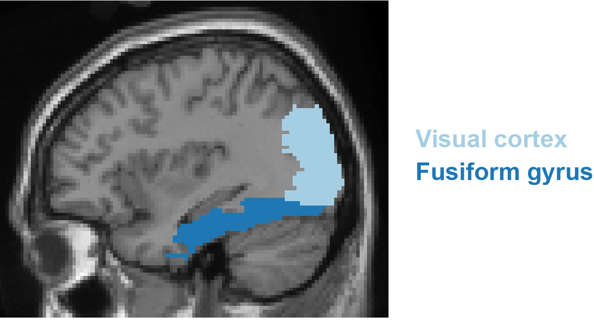

# Electrophysiology {#ephys}

__Written by__ _Vitória Piai_  
<!--__Reviewed by__ _No suggestions yet_  -->

The electrophysiological signal measured over the scalp (with electroencephalography, EEG, or magnetocencephalography, MEG) <!--reflects post-synaptic potentials of thousands of synchronously activated neurons [@lopesdasilva_eeg_2013]. It -->has excellent temporal resolution<!--, which is critical for understanding processes that unfold at the subsecond time scale-->. However, due to volume conduction (i.e., we record the signal at a distance from where it is generated), spatial resolution is poor and underlying sources cannot be inferred from observations of a scalp topography. EEG signals can also be recorded intracranially (iEEG) in neurosurgical cases. iEEG has the advantage of providing excellent spatial resolution in addition to temporal resolution.
 

<!--The MEEG signal can be further processed to produce __event-related responses__ (event-related potentials or ERPs in the case of EEG and event-related fields or ERFs in the case of MEG. An example of ERPs is shown in Figure \@ref(fig:erp-fig).--> 

## EEG studies
Multiple studies using overt picture naming and investigating lexical processes have found a positive deviation in the event-related potentials (ERPs) around 200 ms after stimulus onset (termed the P2 component) that likely reflects lexical selection [@aristei_electrophysiological_2011; @costa_time_2009; @fargier_neural_2020; @rabovsky_semantic_2021; @rose_closer_2019; @strijkers_tracking_2010]. An example of this effect is shown in Figure \@ref(fig:costa). We also know that speech preparation per se modulates the electrophysiological signal, in which case the readiness potential, a slow rising negative-going potential linked to motor response preparation, is observed. This means, for example, that ERPs of two conditions differing in response times could be different simply by virtue of differences in motor response preparation. Therefore, researchers need to pay special attention to this issue when interpreting psycholinguistic effects [see for discussion @piai_electrophysiology_2015]. Electrophysiological markers for other word-production processes are yet to be well-established.  

```{r costa, echo=FALSE, out.width="80%", fig.cap="Event-related potentials in a continuous picture naming task corresponding to the five ordinal positions within semantic categories, thought to tap into lexical selection, time-locked to picture onset. The waveforms originate from ten posterior scalp electrodes. A cumulative increase in signal amplitude over ordinal positions is observed during the time period indicated by the light shaded area. Scalp topographies are shown for the averaged difference waves (the ERP for each position subtracted from its subsequent position), averaged over the two time windows indicated (dark shaded areas). Figure modified from courtesy of Kristof Strijkers."}

```
## MEG studies

MEG studies of picture naming usually provide spatial information in addition to temporal information. The first MEG study on picture naming including source localization showed that, following picture presentation, visual areas show increased activity first, followed by posterior temporal and parietal regions (bilaterally) between around 200-400 ms. Around 500 ms post-picture onset, activity in bilateral ventral precentral gyrus and inferior frontal gyrus increases. Later studies extended these findings, for example using the naming of drawings as either a verb or a noun [@soros_naming_2003]. Activity for both types of naming tasks followed bilaterally from visual cortex in the first 200 ms post-picture onset, to bilateral posterior temporo-parietal regions around 200-400 ms, becoming left-lateralised in pre- and postcentral gyri around 400-800 ms post-picture onset. The location of these areas is shown in Figure \@ref(fig:lateral)).

## iEEG studies
Using picture naming, Edwards et al. [-@edwards_spatiotemporal_2010] found one site in the posterior middle temporal gyrus (yellow in Figure \@ref(fig:lateral)) showing increased activity from around 300 ms post-picture onset until around 200 ms before response, whereas sites in posterior superior temporal gyrus (brown in Figure \@ref(fig:lateral)) showed no increased activity during the same period. Activity related to motor-speech production began around 300 ms before verbal responses in pre- and postcentral gyri (purple and pink, respectively, in Figure \@ref(fig:lateral)), peaking around 100–200 ms after response onset. These results are illustrated in Figure \@ref(fig:edwards)). 

```{r edwards, echo=FALSE, out.width="90%", fig.cap="Activity during picture naming for one participant. a. Locations of the recording sites. The colours correspond to the signal time courses in c. b. Trial events (stimulus and response). c. Activity time courses. Vertical lines indicate stimulus onset and median response onset. Coloured horizontal lines indicate periods of significant amplitude change relative to the pre-stimulus baseline. Modified from the original (i.e., panels removed). Reprinted from NeuroImage, 50/1, Edwards, E., Nagarajan, S. S., Dalal, S. S., Canolty, R. T., Kirsch, H. E., Barbaro, N. M., & Knight, R. T. “Spatiotemporal imaging of cortical activation during verb generation and picture naming”, 291-301, Copyright (2010), with permission from Elsevier."}

```

Another iEEG study used naming to an orally provided definition and visual object naming and identified three stages of cortical activity supporting word production [@forseth_lexical_2018]. The first stage involved modality-dependent sensory processing (auditory or visual cortex, green colours in Figure \@ref(fig:lateral)). The second stage was characterized by lexical processing independent of modality in areas such as the middle fusiform gyrus (dark blue in Figure \@ref(fig:fusiform)) and inferior frontal gyrus (orange in Figure \@ref(fig:lateral)). The final stage was linked to articulatory planning in areas such as pre- and postcentral gyri and auditory cortex, again independent of modality. Dubarry et al. [-@dubarry_estimating_2017] addressed the question whether word-production processes unfold serially or in parallel using a picture naming task and the analysis of significant activity concurrent between regions at the single-trial level. Single-trial analyses revealed relatively high temporal overlap of activity in sensory regions (e.g., visual and auditory cortex). By contrast, in other regions, including regions previously associated with aspects of conceptually driven word production (e.g., superior and middle temporal gyri), the temporal overlap in activity was substantially lower. These results suggest there are limits to the amount of parallel processing involved across word production stages.


```{r fusiform, echo=FALSE, out.width="50%", fig.cap="Location of the occipital cortex and fusiform gyrus."}

```


:::insum
__Take-home messages__  

* EEG and MEG have excellent temporal resolution but poor spatial resolution over the scalp, whereas iEEG has excellent temporal and spatial resolution;  
* The P2 ERP component is emerging as a possible marker of  lexical selection. Markers for other word-production processes are yet to be well-established;  
* Activity flow is structured not only spatially (brain regions) but also in time;  
* Following stimulus presentation, activity flows from sensory areas in the first 200 ms, to temporal and parietal areas. Activity in motor-related areas becomes most prominent around 300 ms prior to articulation and upon articulation, auditory areas become prominent as one hears their own voice;      
* It is unclear whether parallel processing across word-production stages occurs  
:::


:::reading
__Suggestions for further reading__  
The interested reader is referred to additional literature for reviews on EEG/MEG/iEEG in word production [@ganushchak_use_2011; @munding_cortical_2016; @perret_dynamic_2013; @strijkers_cortical_2016; @llorens_intra-cranial_2011], and for other MEG studies on picture naming including source localisation [@liljestrom_comparing_2009; @vihla_cortical_2006; @ala-salomaki_picture_2021; @piai_distinct_2014].
:::


<!-- ADDITIONAL TEXT FOR EXPANSION -->
<!--```{r dubarry, fig.cap='Overview of the temporal overlap between regions that were found to be consistently active during picture naming. Overlap was computed for cases when the total number of trials showing significant activity was at least 20 (an insufficient number of trials is indicated by the + sign). The maximum temporal overlap observed in the supra-threshold activity between all pairs of regions post-picture onset is indicated by the color coding. L. = left; R. = right; G. = gyrus; occ. = occipital; p. = posterior; m. = medial; (para)hipp. = (para)hippocampus; temp. = temporal; a. = anterior. Figure modified from courtesy of Anne Sophie Dubarry.', out.width='80%', fig.asp=.75, fig.align='center'}
```
![Overview of the temporal overlap between regions that were found to be consistently active during picture naming. Overlap was computed for cases when the total number of trials showing significant activity was at least 20 (an insufficient number of trials is indicated by the + sign). The maximum temporal overlap observed in the supra-threshold activity between all pairs of regions post-picture onset is indicated by the color coding. L. = left; R. = right; G. = gyrus; occ. = occipital; p. = posterior; m. = medial; (para)hipp. = (para)hippocampus; temp. = temporal; a. = anterior. Figure modified from courtesy of Anne Sophie Dubarry.](dubarry.png){width=100%} -->
<!--{width=100%} -->

<!--tables generated from `knitr::kable()`, e.g., see Table \@ref(tab:nice-tab).-->
