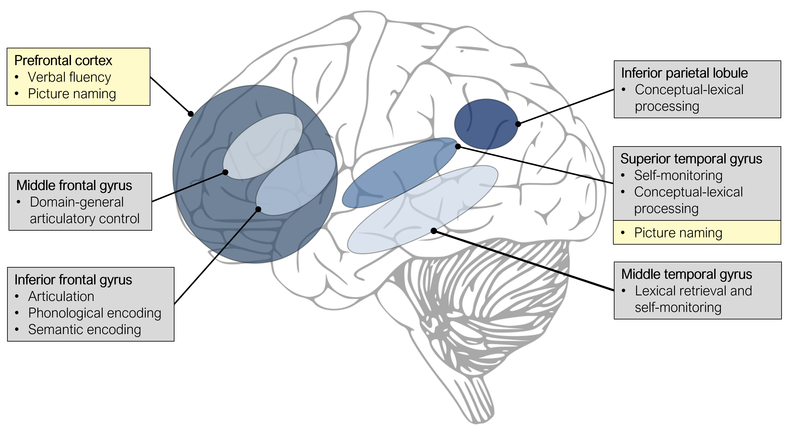
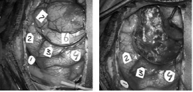

# Non-invasive and Invasive Brain Stimulation {#stim}

__Written by__ _Jana Klaus_ and _Vitória Piai_  
__Edited by__ _Vitória Piai_ for consistency and brevity  
__Reviewed by__ _Ann-Katrin Ohlerth_  

Brain stimulation is a useful tool to investigate causal relationships between confined brain regions and associated functions. By transiently in- or decreasing neuronal activity in the targeted area and measuring performance changes relative to a control condition, inferences can be drawn about the role the targeted area plays in the investigated function. Brain stimulation can be applied non-invasively (i.e., on the scalp) or invasively (i.e., directly on the cortex).

## Non-invasive brain stimulation

Transcranial magnetic stimulation (TMS) and transcranial direct current stimulation (tDCS) are frequently used non-invasive brain stimulation techniques.   

During TMS, a magnetic field applied to the scalp through a magnetic coil connected to a stimulator creates an electric current in the underlying brain tissue. Depending on the stimulation parameters, TMS can cause either inhibitory or facilitatory neuronal changes. <!--Depending on the frequency (ranging between 1 and 50 Hz) and duration of the stimulation, TMS can cause either inhibitory or facilitatory neuronal changes. -->TMS targets the underlying brain regions relatively focally, especially when combined with neuronavigation, where the position of the coil is adjusted based on a standard or individual MR image. For the majority of studies investigating language production, researchers make use of repetitive TMS (rTMS), during which several pulses are given in quick succession. Applying rTMS online (i.e., during the execution of a task) allows for a direct behavioural readout of the induced perturbation. <!-- Moreover, when given at a specific time point during a trial, it is possible to influence the underlying linguistic process assumed to be taking place at this time (much like a stimulus onset asynchrony manipulation in a picture-word interference task).-->

During tDCS, a weak current <!--(typically 1-2 mA)--> is applied between two or more electrodes affixed to the scalp. A small portion of this current reaches the underlying grey matter. <!--Anodal tDCS is assumed to increase spontaneous neural firing, subsequently improving behaviour, while cathodal tDCS reduces spontaneous neural firing, resulting in performance decreases [@stagg_physiological_2011].--> However, while tDCS inhibitory and excitatory effects are fairly well documented for stimulation of the primary motor cortex, their extension to other brain regions and functions is far from clear. Furthermore, <!--it should be noted that the -->neural effects of tDCS are substantially smaller, less focal, and less time-sensitive than those obtained from TMS. On the plus side, tDCS is much easier to apply than TMS and allows for a more stringent participant and experimenter blinding. 

### Findings from TMS
The most vivid illustration of the effect of TMS on language production is that of speech arrest: The normal speech stream can be disrupted by applying repeated pulses of TMS to the cortex, and in particular to the left IFG, resulting in slurred speech without semantic content or complete mutism (i.e., no speech is produced) [@pascual-leone_induction_1991; @epstein_optimum_1996; @epstein_localization_1999]. These effects are transient, and speaking resumes as soon as the stimulation stops. While TMS-induced speech arrest does provide a clear demonstration of how the perturbation of certain brain areas can modulate language production performance, it is a rather crude approach that only allows for a binary evaluation of the effect (i.e., speech arrest present or not). In subsequent studies, effects of TMS were investigated in more detail, for example by analysing changes in naming latencies [@schuhmann_speaking_2012] or the types of errors produced [@krieg_cortical_2016]. <!--For example, using an event-related design in a picture naming task, Schuhmann et al. [-@schuhmann_speaking_2012] applied <!--three pulses of 40-Hz rTMS at 150, 225, 300, 400, or 525 ms after picture onset to the IFG, MTG, or STG (see for anatomy Figure \@ref(fig:lateral)). Relative to picture naming without TMS, naming latencies were delayed when (a) the left MTG was stimulated 225 and 400 ms after picture onset, (b) the left IFG was stimulated 300 ms after picture onset, and (c) the left STG was stimulated 400 ms after picture onset. This was interpreted as an early role of the MTG in lexical selection, the IFG in phonological encoding, and MTG and STG in self-monitoring (see Sections \@ref(CognitiveArchitectureI), \@ref(CognitiveArchitectureII) and \@ref(CognitiveArchitectureIII)). --> 

Krieg and colleagues [-@krieg_cortical_2016] analysed the frequency and type of speech errors (see Sections \@ref(intro) and \@ref(disorders)) induced by pulses of TMS across the left hemisphere during a picture naming task. Speech errors were clustered in two components. Regions in the left inferior parietal lobule (see Figure \@ref(fig:NIBS)) and left STG were mostly associated with omissions, which was interpreted as involvement of these areas in early conceptual-lexical processes of word production. In another study investigating both hemispheres with object and action naming, analysis of errors showed hubs in left and right STG and MTG associated with conceptual and lexical errors [@ohlerth_bihemispheric_2021]. 

Due to the relatively high focality of TMS, it is also possible to dissociate functional contributions of adjacent brain areas. For example, Klaus and Hartwigsen [-@klaus_dissociating_2019] investigated whether semantic and phonological processing in language production is differentially subserved by left anterior and posterior IFG, respectively. In this study, participants were presented with nouns (e.g., “pear”) and asked to produce either a semantically related word (e.g., “apple”) or a rhyme word (e.g., “bear”). Five hundred milliseconds after stimulus onset, <!--five pulses of 10-Hz -->rTMS was applied to either the left anterior IFG, the left posterior IFG, or the vertex (i.e., highest point on top of your head) as a control site. Results showed that participants were slower in the semantic task during stimulation of the left anterior IFG, but faster in the phonological task during stimulation of the left posterior IFG, relative to the other stimulation sites, respectively. These findings thus provided direct evidence for the task-specific involvement of different portions of the left IFG in language production.


### Findings from transcranial direct current stimulation
Similar to TMS studies, the most targeted regions in tDCS studies are the left prefrontal cortex (see Figure \@ref(fig:NIBS)) and STG. For example, verbal fluency has been shown to improve during or following <!--anodal -->tDCS of the left prefrontal cortex [@cattaneo_transcranial_2011; @iyer_safety_2005; @penolazzi_electrode_2013]. Moreover, faster picture naming was found during <!--anodal -->tDCS over the left STG [@sparing_enhancing_2008] or the left prefrontal cortex [@fertonani_naming_2010]. However, more recent non-replications of these findings [@klaus_failure_2020; @westwood_transcranial_2017; @westwood_null_2018] have cast doubt on the efficacy of this technique to successfully modulate language performance in healthy individuals. Large inter- and intraindividual variability in the response to tDCS combined with suboptimal experimental procedures (e.g., non-focal electrode montages, insufficient experimenter blinding, between-participant designs) are likely the driving forces behind the inconsistent findings. Thus, for tDCS to be a valuable neuroscientific technique in the investigation of language production, meticulous fundamental research is required to establish stable baseline effects which can subsequently be modulated.


```{r NIBS, echo=FALSE, out.width="80%", fig.cap="Overview of left-hemispheric brain regions involved in language production, as indicated by TMS (grey boxes) and tDCS studies (yellow boxes)."}

```

## Invasive brain stimulation
With invasive, direct cortical stimulation, an electric current is delivered to the surface of the brain, which causes a transient lesion in the stimulated location. This technique is only used in patients who need brain surgery (for example because of a brain tumour or a focus causing epileptic seizures): The skull is opened as part of the neurosurgical procedure and stimulation is applied to determine which brain areas can be removed while avoiding functional deficits for the patient. A commonly used procedure is to ask patients to name pictures during stimulation. From that, a "map" can be derived (see for an example Figure \@ref(fig:des)), indicating which areas are causally related to language production. From a clinical perspective, these areas are so-called "eloquent" and should not be removed. At the same time, these maps are very informative for our understanding of the neural basis of language production. Note that this mapping procedure can also be applied to navigated TMS [e.g., Ohlerth et al. -@ohlerth_bihemispheric_2021].  


```{r des, echo=FALSE, out.width="80%", fig.cap="Intraoperative photograph of the exposed cortical surface before (left) and after (right) the removal of the tumour. The numbers indicate the locations that were tested with direct cortical stimulation."}

```


Errors in articulation are commonly caused by stimulating the lower (so-called "ventral") part of the left precentral and postcentral gyri [@sarubbo_mapping_2020]. Anomias and semantic paraphasias are commonly caused by stimulating the left STG and MTG (especially the mid and posterior portions) and the inferior parietal lobule. Finally, phonological errors are caused by stimulating a similar network, in addition to the left IFG and middle frontal gyrus [@chang_stereotactic_2017; @corina_analysis_2010; @miozzo_topographical_2017; @sarubbo_mapping_2020]. See Figure \@ref(fig:lateral) for these anatomical locations.


:::insum
__Take-home messages__   

* Results from TMS studies have implicated the left anterior IFG, and posterior MTG and STG in conceptual-lexical and the posterior IFG in phonological processing in language production  
* tDCS over left prefrontal and temporal regions can improve verbal fluency and picture naming performance, although these effects seem to be less robust than initially thought    
* Findings from direct cortical stimulation show large convergence with non-invasive methods, with a division between conceptual-lexical, phonological, and articulatory processes over different brain areas: semantic errors and anomias are associated with left temporal and inferior parietal cortex, whereas articulation (motor speech) is associated with left frontal areas  
:::


:::reading
__Suggestions for further reading__  
For more details on non-invasive brain stimulation techniques, the interested reader is referred to reviews on TMS [@pitcher_transcranial_2021] and tDCS [@woods_technical_2016]. For the efficacy of TMS and tDCS to modulate language production performance, the interested reader is referred to two meta-analyses [@klaus_non-invasive_2018; @westwood_transcranial_2017]. For more details on and examples of invasive brain stimulation, the interested reader is referred to review papers [@hamberger_cortical_2007; @rofes_language_2014] and empirical papers [@hamberger_functional_2016; @sierpowska_words_2017].
:::
